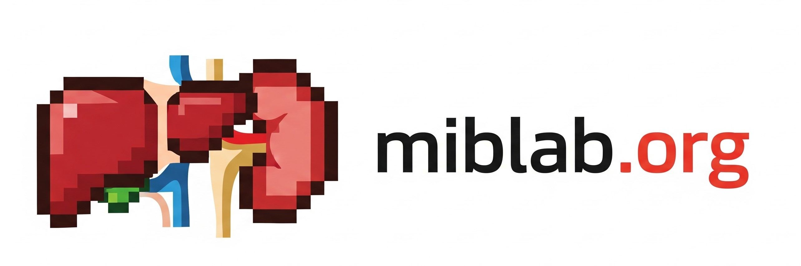

# Repositories
---

## 🌐 Websites

- [miblab.org](https://github.com/openmiblab/miblab). miblab main website.
  
---

## 🐍 Python packages

In use - in order of maturity:

- **dcmri:** Modelling and analysing dynamic contrast MRI ([code](https://github.com/dcmri/dcmri), [docs](https://github.com/dcmri/dcmri-docs), [web](https://dcmri.org/), [pypi](https://pypi.org/project/dcmri)).
- **mdreg:** Model-driven image registration ([code](https://github.com/openmiblab/pckg-mdreg), [docs](https://github.com/openmiblab/docs-mdreg), [web](https://openmiblab.github.io/docs-mdreg), [pypi](https://pypi.org/project/mdreg)).
- **vreg:** Multidimensional arrays with spatial awareness ([code](https://github.com/openmiblab/pckg-vreg), [docs](https://github.com/openmiblab/docs-vreg), [web](https://openmiblab.github.io/docs-vreg), [pypi](https://pypi.org/project/vreg)).
- **numpyradiomics:** A pythonic reimplementation of the pyradiomics package ([code](https://github.com/openmiblab/pckg-numpyradiomics), [docs](https://github.com/openmiblab/docs-numpyradiomics), [web](https://openmiblab.github.io/docs-numpyradiomics), [pypi](https://pypi.org/project/numpyradiomics)).
- **pydmr:** A Python API for the .dmr data format ([code](https://github.com/openmiblab/pckg-pydmr), [docs](https://github.com/openmiblab/docs-pydmr), [web](https://openmiblab.github.io/docs-pydmr), [pypi](https://pypi.org/project/pydmr)).
- **dbdicom:** Reading and writing DICOM databases ([code](https://github.com/openmiblab/pckg-dbdicom), [docs](https://github.com/openmiblab/docs-dbdicom), [web](https://openmiblab.github.io/docs-dbdicom), [pypi](https://pypi.org/project/dbdicom)).
- **miblab:** Core miblab infrastructure tools ([code](https://github.com/openmiblab/pckg-miblab), [docs](https://github.com/openmiblab/docs-miblab), [pypi](https://pypi.org/project/miblab)).
- **miblab-dl:** Python API for deep-learning models trained by miblab ([code](https://github.com/openmiblab/pckg-miblab-dl), [docs](https://github.com/openmiblab/docs-miblab-dl), [pypi](https://pypi.org/project/miblab-dl)).
- **miblab-data:** Python API for reading public miblab data ([code](https://github.com/openmiblab/pckg-miblab-data), [docs](https://github.com/openmiblab/docs-miblab-data), [pypi](https://pypi.org/project/miblab-data)).
- **miblab-plot:** Plotting utilities used across miblab pipelines ([code](https://github.com/openmiblab/pckg-miblab-plot), [pypi](https://pypi.org/project/miblab-data-plot)).
- **miblab-ssa:** Tools for statistical shape analysis ([code](https://github.com/openmiblab/pckg-miblab-ssa), [pypi](https://pypi.org/project/miblab-data-ssa)).

Work in progress - not in use:

- **wezel:** GUI for DICOM read and write ([code](https://github.com/openmiblab/pckg-wezel), [pypi](https://pypi.org/project/wezel)).

---

## 🧬 Analysis pipelines

- [ppln-template](https://github.com/openmiblab/ppln-template): Template for a miblab pipeline.

#### The TRISTAN project

Mature:

- [ppln-tristan-human_modelling](https://github.com/openmiblab/ppln-tristan-human_modelling): Human kinetic analysis
- [tristan-rat-modelling](https://github.com/openmiblab/tristan-rat-modelling): Rat kinetic analysis.
- [tristan-human-stage-3-analysis](https://github.com/openmiblab/tristan-human-stage-3-analysis): Data analysis of first in human study.
- [tristan-rat-analysis](https://github.com/openmiblab/tristan-rat-analysis): Data analysis of rat studies

Work in progress - not functional:

- [tristan-human-stage-1-processing](https://github.com/openmiblab/tristan-human-stage-1-processing): Image processing for human data.

#### The iBEAT project

Mature:

- [iBEAt-fatwater](https://github.com/openmiblab/iBEAt-fatwater): Model training for fat-water mapping.
- [ppln-ibeat-dixon](https://github.com/openmiblab/ppln-ibeat-dixon): Creating a clean Dixon database.
- [ppln-ibeat-totseg](https://github.com/openmiblab/ppln-ibeat-totseg): Total segmentation of organs on iBEAT Dixon data.

Work in progress - fully functional:

- [ppln-ibeat-kidney_shape](https://github.com/openmiblab/ppln-ibeat-kidney_shape): Renal volumetry and standard shape analysis.
- [ppln-ibeat-kidney_ssa](https://github.com/openmiblab/ppln-ibeat-kidney_ssa): Statistical shape analysis for kidney data.

Work in progress - not functional:

- [ppln-ibeat-diff](https://github.com/openmiblab/ppln-ibeat-diff): Renal diffusion MRI
- [ppln-ibeat-data_clean](https://github.com/openmiblab/ppln-ibeat-data_clean): Dixon data cleaning.
- [ppln-ibeat-t2star](https://github.com/openmiblab/ppln-ibeat-t2star): Kidney T2* in iBEAt
- [iBEAt-dixon-pdff](https://github.com/openmiblab/iBEAt-dixon-pdff): PDFF calculation from iBEAt Dixon data
- [iBEAt-rsf](https://github.com/openmiblab/iBEAt-rsf): Renal sinus fat calculation.
- [ppln-ibeat-dce](https://github.com/openmiblab/ppln-ibeat-dce): Magnetic resonance renography (v1)
- [iBEAt-pipeline-dce](https://github.com/openmiblab/iBEAt-pipeline-dce): Magnetic resonance renography (duplicate)

---

## 🧩 Challenge(s)

- [spiro-challenge](https://github.com/openmiblab/challenge-spiro): Fast mechanistic model inversion with deep-learning.

---

## 🎓 Education

- [tutorial-cluster](https://github.com/openmiblab/tutorial-cluster): Tutorial on HPC usage in Sheffield.
- [case-studies](https://github.com/openmiblab/case-studies): End-to-end processing of individual cases

---

## 📚 Papers

- [tristan-paper-first-in-human](https://github.com/openmiblab/tristan-paper-first-in-human): First in human paper
